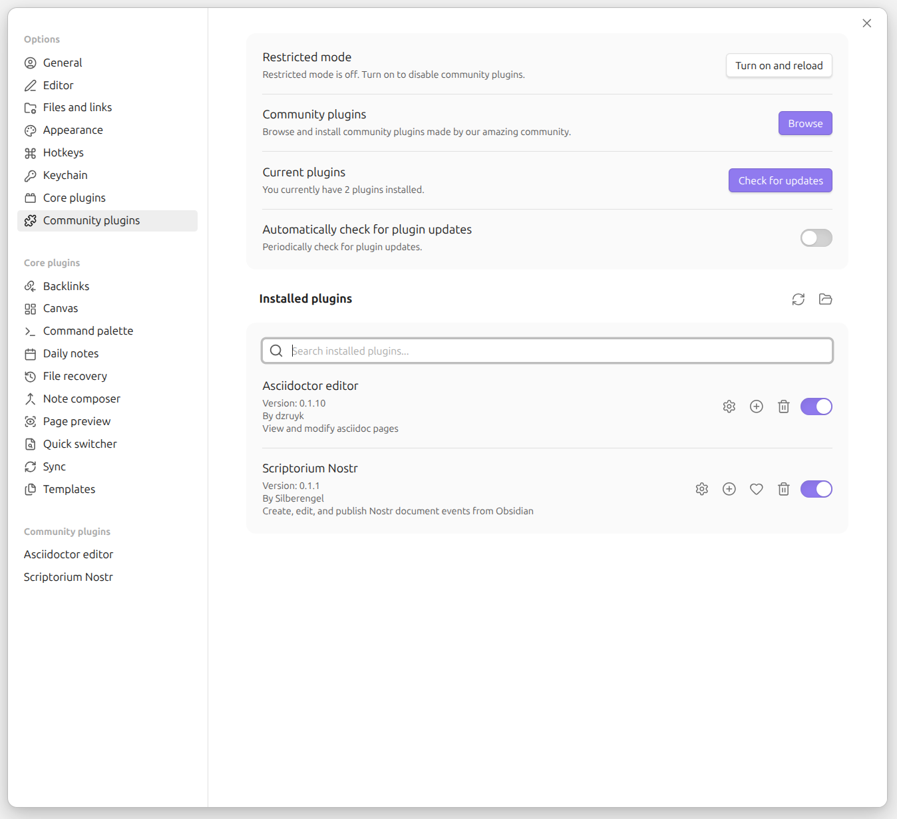
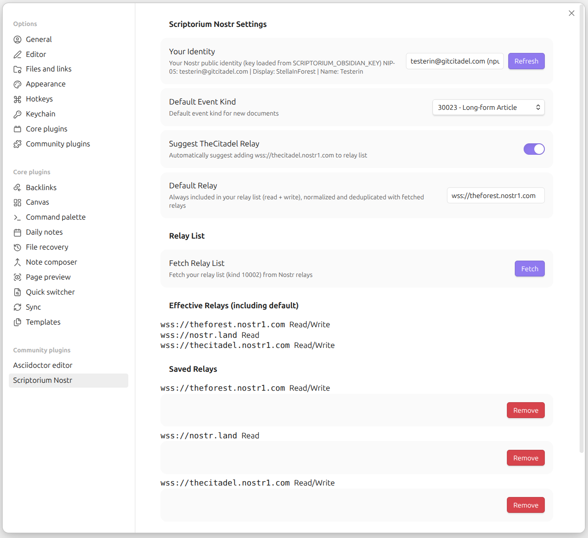
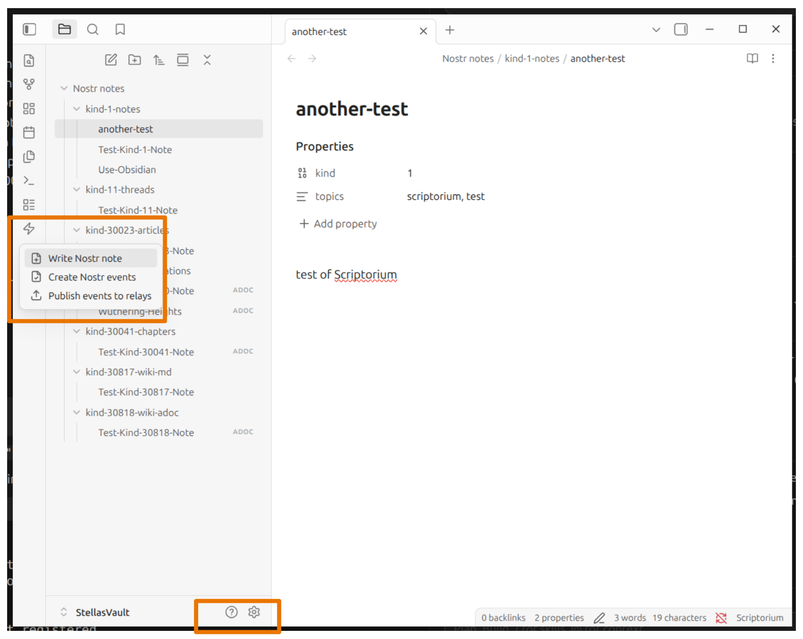

# Scriptorium Nostr

An Obsidian plugin for creating, editing, and publishing Nostr document events directly from your vault.

**Author:** [Silberengel](https://jumble.imwald.eu/users/npub1l5sga6xg72phsz5422ykujprejwud075ggrr3z2hwyrfgr7eylqstegx9z)

**This repo:** 
on Gitea https://git.imwald.eu/silberengel/scriptorium-obsidian
on GitHub https://github.com/Silberengel/scriptorium-obsidian

## Features

- **Multiple event kinds**: Markdown (1, 11, 30023, 30817) and AsciiDoc (30040, 30041, 30818)
- **Automatic structure parsing**: AsciiDoc documents with headers are parsed into nested 30040/30041 event hierarchies
- **NKBIP-08 support**: Hierarchical book wikilinks with optional collection tags for compendiums, digests, and libraries
- **Flexible structure**: Supports both two-level (book + chapters) and three-level (book + chapters + sections) hierarchies
- **Metadata in files**: Metadata stored directly in Markdown frontmatter or AsciiDoc header attributes
- **Two-step workflow**: Create/sign events separately from publishing to relays
- **Automatic relay management**: Fetch relay lists (kind 10002) with AUTH support

## Quick Start

Before beginning, install [Obsidian](https://obsidian.md) and create a vault. Use the folder location of the vault in place of `~/Documents/MyVault`.

**Important:** This plugin reads your Nostr private key **only** from the environment variable `SCRIPTORIUM_OBSIDIAN_KEY`. There is no settings field to paste a key. You must export the variable **in the same terminal session** before starting Obsidian — otherwise signing and publishing will not work.

### 1. Set up your Nostr key (do this first)

**Generate a key** (if you do not already have one):

```bash
./start-obsidian.sh --generate-key
```

Copy the `export SCRIPTORIUM_OBSIDIAN_KEY="nsec1..."` line from the output.

**Load the key in your shell** (every time you open a new terminal, unless you add it to your profile):

```bash
export SCRIPTORIUM_OBSIDIAN_KEY="nsec1..."
```

**Optional but recommended** — add that export line to your shell profile so every new terminal has the key automatically (see below).

#### Add the key to your shell profile (persistent)

Your **profile** is a small script your shell runs when you open a terminal. Adding the `export` line there means you do not have to type it every time.

**1. Choose the right file**

| Shell | Profile file |
| ----- | ------------ |
| Bash (default on many Linux distros) | `~/.bashrc` |
| Zsh (default on macOS) | `~/.zshrc` |

Not sure which you use? Run `echo $SHELL` — if it ends in `zsh`, use `~/.zshrc`; if `bash`, use `~/.bashrc`.

**2. Open the file in a text editor**

```bash
nano ~/.bashrc
# or
nano ~/.zshrc
```

**3. Add this line at the end** (use your real `nsec`, from `--generate-key` or your existing key):

```bash
export SCRIPTORIUM_OBSIDIAN_KEY="nsec1..."
```

Save and exit (`Ctrl+O`, `Enter`, `Ctrl+X` in nano).

**4. Load the profile in your current terminal** (or open a new terminal):

```bash
source ~/.bashrc
# or
source ~/.zshrc
```

**5. Verify it is set** (should print your `nsec` — do not share this output):

```bash
echo $SCRIPTORIUM_OBSIDIAN_KEY
```

**6. Start Obsidian from that terminal:**

```bash
./start-obsidian.sh
```

**Security:** The profile file contains your private key in plain text. Restrict permissions so only you can read it:

```bash
chmod 600 ~/.bashrc   # or ~/.zshrc
```

If you launch Obsidian from a desktop shortcut instead of the terminal, it will **not** see variables from your profile. Always use `./start-obsidian.sh` (or start Obsidian from a terminal where you have run `source ~/.bashrc` / `source ~/.zshrc`).

### 2. Install and start Obsidian

Run this **after** exporting the key in the same terminal:

```bash
# First run (vault path required)
./start-obsidian.sh ~/Documents/MyVault

# Subsequent runs (path saved)
./start-obsidian.sh
```

The script installs dependencies, builds the plugin, and launches Obsidian with your shell environment (including the key).

Enable **Scriptorium Nostr** under **Settings → Community plugins** (gear icon opens plugin settings):



### 3. Configure relays (inside Obsidian)

Open **Settings → Community plugins → Scriptorium Nostr** (gear icon), or pick **Scriptorium Nostr** in the settings sidebar.



1. Confirm **Your Identity** shows your npub and that it says the key was loaded from `SCRIPTORIUM_OBSIDIAN_KEY` (if not, close Obsidian, export the key, and run `./start-obsidian.sh` again)
2. Set your **Default Relay** (always included in read/write relay list)
3. Click **Fetch** to load your kind 10002 relay list

### Already installed but no key working?

Close Obsidian completely, then in a terminal:

```bash
export SCRIPTORIUM_OBSIDIAN_KEY="nsec1..."
./start-obsidian.sh
```

Do not paste the key into Obsidian settings — it is not stored there and will not be read from the vault.

## Usage

Click the **lightning bolt (Nostr)** icon in the left ribbon to open the main menu:



### Creating Events

1. Open a Markdown or AsciiDoc file
2. Run command: **Create Nostr Events**
3. A reminder modal will prompt you to update metadata
4. Update metadata in the file (see Metadata section below)
5. Click "OK" in the modal
6. Events are created, signed, and saved to `{filename}_events.jsonl`

### Publishing Events

1. Ensure events exist (`{filename}_events.jsonl`)
2. Run command: **Publish Events to Relays**
3. Events publish to all configured write relays

### Other Commands

- **Edit Metadata** - Open metadata editor for current file
- **Preview Document Structure** - Show event hierarchy (AsciiDoc structured documents only)
- **New Nostr Document** - Create a new document with metadata template
- **Delete Nostr Events** - Remove the `{filename}_events.jsonl` sidecar for the current file

## File Formats

### Markdown Files (`.md`)

Supported event kinds: **1**, **11**, **30023**, **30817**

Metadata is stored in YAML frontmatter at the top of the file:

```yaml
---
kind: 30023
title: "My Article"
author: "Author Name"
summary: "Article summary"
image: "https://example.com/image.jpg"
topics: "bitcoin, nostr"
---
```

**Note**: The `published_at` tag is automatically generated with the current UNIX timestamp during event creation for all replaceable event kinds. It should not be included in metadata and will be ignored if present.

### AsciiDoc Files (`.adoc`)

Supported event kinds: **30040**, **30041**, **30818**

**Simple AsciiDoc** (kind 30818):

```asciidoc
= Sourdough Bread

:kind: 30818
:author: John Doe
:summary: All about proofing and maintaining a sourdough.
:image: https://example.com/image.jpg
:topics: baking, sourdough, bread

This is an article on the topic of sourdough bread baking...
```

**Structured AsciiDoc** (kind 30040 with nested 30041):

**Three-level structure** (book + chapters + subchapters/sections):

```asciidoc
= Book Title

:kind: 30040
:author: Jane Doe
:type: book
:summary: Book description
:collection_id: bible
:version_tag: kjv

== Chapter 1

Chapter content here...

=== Section 1.1

Section content...
```

**Two-level structure** (book + chapters, no sections):

```asciidoc
= Book Title

:kind: 30040
:author: Author Name
:type: book
:summary: Book description

== Chapter 1

Chapter content here...

== Chapter 2

Chapter content here...
```

In two-level structures, chapters are created as 30041 events directly under the root 30040.

When publishing, metadata is automatically stripped from content before creating events.

### NKBIP-08 Tag Inheritance

For structured AsciiDoc documents (kind 30040), NKBIP-08 tags are automatically assigned based on the document hierarchy:

- **C tag (collection_id)**: Optional, set in root 30040 metadata. If set, inherited by all events in the hierarchy. Use for compendiums, digests, or libraries of related books (e.g., "bible", "goethe-complete-works", "encyclopedia-britannica").
- **T tag (title_id)**: Always set from root 30040 book title, inherited by all nested events.
- **c tag (chapter_id)**: 
  - Two-level structure: from 30041 chapter title (chapters are 30041 events)
  - Three-level structure: from parent 30040 chapter title
- **s tag (section_id)**: Only in three-level structures, from 30041 section title
- **v tag (version_tag)**: If set in root 30040, inherited by all events in the hierarchy

All tag values are normalized per NKBIP-08 spec (lowercase, hyphens, numbers only).

## Event Kind Templates

All event kinds are defined as **JSON templates** in plugin settings (Settings → Event Kind Templates). Seven default templates ship with the plugin; you can edit them or add custom presets.

- **Default templates** use ids ending in `-default` (e.g. `kind-30023-default`, `kind-30040-default`) and `type: "default"`. They can be reset to shipped JSON but not deleted.
- **Custom templates** use `type: "custom"` and can be deleted.
- Multiple templates may share the same Nostr **kind** (e.g. a magazine preset and blog preset both using kind `30023`). Documents store `templateId` in metadata to disambiguate.
- Relay behavior (regular / replaceable / addressable per NIP-01) is derived from the kind number, not from template config.
- `published_at` and `d` tags are added automatically based on NIP-01 kind class.

Reference: [`src/shippedKindTemplates.json`](src/shippedKindTemplates.json) and [`src/defaultKindTemplates.ts`](src/defaultKindTemplates.ts).

### Editing templates

1. Open **Settings → Scriptorium Nostr Settings → Event Kind Templates**
2. Click **Edit** on a template to open the JSON editor
3. Click **Validate** before **Save**
4. Use **Reset** (per default template) or **Reset All Defaults** to restore shipped presets

### Example custom template

```json
{
  "id": "magazine-30023",
  "type": "custom",
  "kind": 30023,
  "name": "Magazine Article",
  "markup": "markdown",
  "structured": false,
  "folderName": "magazine-articles",
  "fields": [
    { "key": "title", "tagType": "title", "description": "Article title", "required": true },
    { "key": "issue", "tagType": "text", "description": "Magazine issue number", "required": false }
  ]
}
```

## Event Kinds (default templates)


| Kind  | Default template id   | Format   | Description          | Title Required |
| ----- | --------------------- | -------- | -------------------- | -------------- |
| 1     | kind-1-default        | Markdown | Normal note          | No             |
| 11    | kind-11-default       | Markdown | Discussion thread OP | Yes            |
| 30023 | kind-30023-default    | Markdown | Long-form article    | Yes            |
| 30040 | kind-30040-default    | AsciiDoc | Publication index    | Yes            |
| 30041 | kind-30041-default    | AsciiDoc | Publication content  | Yes            |
| 30817 | kind-30817-default    | Markdown | Wiki page            | Yes            |
| 30818 | kind-30818-default    | AsciiDoc | Wiki page            | Yes            |


### Stand-alone vs Nested 30041

- **Stand-alone 30041**: Uses NKBIP-01 tags (d, title, image, summary, topics) plus automatically-generated `published_at`
- **Nested 30041** (under 30040): Uses NKBIP-08 tags plus automatically-generated `published_at`
  - **Two-level structure** (book + chapters): 30041 events are chapters (c tag from chapter title, no s tag)
  - **Three-level structure** (book + chapters + sections): 30041 events are sections (c tag from parent chapter, s tag from section title)
  - All nested 30041 events inherit C tag (collection_id) and v tag (version_tag) from root 30040
  - All nested 30041 events get T tag (title_id) from root 30040 book title

## Metadata Fields

All predefined metadata fields are shown in frontmatter/attributes with placeholder descriptions. Remove or update placeholders you don't need. Placeholder values are automatically skipped when creating events.

**Important**: The `published_at` tag is automatically generated for NIP-01 replaceable and addressable kinds during event creation. Do not include `published_at` in metadata. Documents also store `templateId` alongside `kind` in frontmatter or AsciiDoc attributes.

### Common Fields

- `templateId` - Template preset id (e.g. `kind-30023-default`)
- `kind` - Nostr event kind (required)
- `title` - Document title (required for all except kind 1)
- `author` - Author name
- `summary` - Brief description
- `topics` - Comma-separated topics (available for all event kinds)
- `image` - Image URL (available for 30023, 30040, 30041, 30817, 30818)

### Kind-Specific Fields

**30023 (Article)**:

- No additional fields beyond common ones

**30040 (Publication Index)**:

- `type` - Publication type (book, illustrated, magazine, documentation, academic, blog)
- `version` - Version or edition
- `published_on` - Publication date
- `published_by` - Publisher
- `source` - Source URL
- `auto_update` - Auto-update behavior (yes, ask, no)
- `collection_id` - NKBIP-08 collection identifier (C tag) - **Optional**: compendium, digest, or library of related books (e.g., "bible", "goethe-complete-works", "encyclopedia-britannica"). If set in root 30040, inherited by all events in the hierarchy.
- `version_tag` - NKBIP-08 version identifier (v tag) - If set in root 30040, inherited by all events in the hierarchy

**30041 (Publication Content)**:

- **Stand-alone**: Same as 30023 (image, summary, topics)
- **Nested** (under 30040): NKBIP-08 tags
  - `collection_id` - Inherited from root 30040 (C tag)
  - `title_id` - From root 30040 book title (T tag)
  - `chapter_id` - From chapter title (c tag)
    - Two-level: from 30041's own title (it is the chapter)
    - Three-level: from parent 30040's title
  - `section_id` - From 30041's title (s tag) - Only in three-level structures
  - `version_tag` - Inherited from root 30040 (v tag)

## Manual Installation

1. Clone repository
2. Run `npm install && npm run build`
3. Copy `main.js` and `manifest.json` to `.obsidian/plugins/scriptorium-obsidian/`
4. Enable in Obsidian Settings → Community Plugins (see screenshot in [Quick Start](#2-install-and-start-obsidian))
5. Install [obsidian-asciidoc](https://github.com/dzruyk/obsidian-asciidoc) plugin (required for `.adoc` files)
6. **Before using signing/publishing:** set `SCRIPTORIUM_OBSIDIAN_KEY` in your environment and restart Obsidian from a terminal that has the variable exported (see Quick Start step 1)

## Development

Requires desktop Obsidian (`isDesktopOnly` in manifest).

```bash
npm install
npm run dev      # Watch mode — rebuilds on file changes
npm run build    # Production build
npm run lint     # ESLint check
npm run lint:fix # ESLint auto-fix
```

## License

MIT